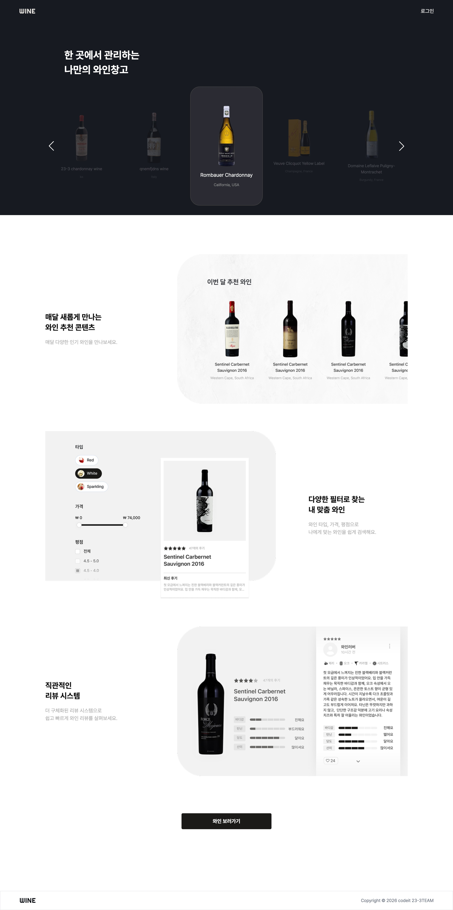

#  WINE



다양한 와인에 대한 리뷰를 보고, 구매 여부를 판단해볼 수 있는 웹 서비스  
와인의 종류, 맛, 가격대, 별점을 기반으로 리뷰를 작성할 수 있으며, 다양한 필터를 적용해서 와인을 골라서 볼 수 있다.

🔗 배포 링크  
https://wine-fe23-3.vercel.app/

---

## ✨ 주요 기능

👤 **회원 가입** : 이메일, 닉네임 정보를 입력하여 간편하게 서비스에 가입할 수 있다.

🔑 **로그인** : 일반 로그인 및 카카오 계정을 이용한 소셜 로그인을 할 수 있다.

🍷 **이번 달 와인 추천** : 사용자 평점을 분석하여 최적의 와인을 추천해 준다.

🎚️ **다양한 필터** : 와인 타입, 가격, 평점 등 상세 필터로 취향에 맞는 와인을 고를 수 있다.

🔍 **와인 검색** : 찾고 싶은 와인을 키워드로 빠르게 검색할 수 있다.

❤️ **좋아요** : 유익한 리뷰에 좋아요를 남겨 다른 사용자와 소통할 수 있다.

📝 **와인/리뷰 등록** : 새로운 와인 정보나 시음 후기를 직접 등록할 수 있다.

🔄 **와인/리뷰 수정** : 내가 작성한 와인 정보와 리뷰를 자유롭게 수정할 수 있다.

🗑 **와인/리뷰 삭제** : 불필요해진 기록이나 잘못 등록된 정보를 삭제할 수 있다.

⚙️ **프로필 수정** : 닉네임과 프로필 이미지를 변경하여 나만의 계정을 설정할 수 있다.

---

## 🛠 기술 스택

### Frontend


### Tools


### Deployment


### Communication


---

## 📁 프로젝트 구조

```
src
├── app                           # Next.js App Router (페이지 및 라우팅)
│   ├── (페이지 이름)                # 각 기능별 라우트 단위
│   │   ├── components            # 해당 페이지 내에서만 사용되는 하위 컴포넌트
│   │   └── page.tsx              # 페이지 진입점
│   ├── layout.tsx                # 공통 레이아웃
│   ├── not-found.tsx             # 404 에러 페이지
│   └── page.tsx                  # 메인 페이지
├── assets                        # 정적 리소스 관리
│   ├── icons                     # SVG 아이콘 파일
│   └── images                    # PNG, JPG 등 이미지 파일
├── components                    # 공통/재사용 UI 컴포넌트
│   └── (컴포넌트 이름)
│       ├── (컴포넌트 이름).tsx
│       └── type.ts               # 컴포넌트 전용 Props 타입 정의
├── constants                     # 전역 상수 관리
├── hooks                         # 커스텀 훅
├── lib                           # 라이브러리 설정 및 유틸리티
│   ├── api                       # Axios 인스턴스 및 API 요청 함수
│   └── utils.ts                  # 공통 유틸리티 함수
├── stores                        # Zustand 기반의 전역 상태 관리
├── styles                        # 전역 스타일 관리
└── types                         # TypeScript 타입 정의
```

---

## 🚀 실행 방법

```bash
# 1. 저장소 클론
git clone https://github.com/2ruuuu/wine.git

# 2. 프로젝트 폴더 이동
cd wine

# 3. 패키지 설치
yarn install

# 4. 환경 변수 설정
touch .env.local

# 4. 개발 서버 실행
yarn dev
```

<br />

**`.env.local` 파일 내용**

```bash
# Deployment (배포 환경에서만 필수, 로컬은 생략 가능)
NEXT_PUBLIC_SITE_URL=https://wine-fe23-3.vercel.app

# API & Auth
NEXT_PUBLIC_API_BASE_URL=API_서버_주소
NEXT_PUBLIC_KAKAO_CLIENT_ID=카카오_자바스크립트_키
NEXT_PUBLIC_KAKAO_REDIRECT_URI=http://localhost:3000/카카오_리다이렉트_경로
```

---

## 👥 팀원 및 역할

<table>
  <tr>
    <td width="150" height="150" align="center">
      <a href="https://github.com/KuJiHye">
        
      </a><br/>
      구지혜(팀장)
    </td>
    <td width="600">
      <ul>
        <li>로그인(카카오 로그인), 회원가입, 404 페이지</li>
        <li>공통컴포넌트 Input, Button</li>
        <li>API 모듈화, SEO 최적화, 환경변수 설정, 전역 상태 관리, 로딩, 토스트</li>
        <li>문서정리, 발표 PPT 제작</li>
      </ul>
    </td>
  </tr>
  <tr>
    <td width="150" height="150" align="center">
      <a href="https://github.com/ejlee6742-source">
        
      </a><br/>
      이은지
    </td>
    <td width="600">
      <ul>
        <li>메인페이지</li>
        <li>공통컴포넌트 Header, Footer, Modal</li>
        <li>와인 / 리뷰 등록 모달</li>
        <li>API 데이터 넣기, 발표 PPT 제작 보조</li>
      </ul>
    </td>
  </tr>
  <tr>
    <td width="150" height="150" align="center">
      <a href="https://github.com/moonky-1">
        
      </a><br/>
      최문경
    </td>
    <td width="600">
      <ul>
        <li>마이프로필 페이지</li>
        <li>공통컴포넌트 Layout</li>
        <li>QA 리스트업</li>
      </ul>
    </td>
  </tr>
  <tr>
    <td width="150" height="150" align="center">
      <a href="https://github.com/2ruuuu">
        
      </a><br/>
      최일우
    </td>
    <td width="600">
      <ul>
        <li>와인 상세 페이지</li>
        <li>공통컴포넌트 Taste, StarRating</li>
        <li>발표 대본 준비, 발표</li>
      </ul>
    </td>
  </tr>
  <tr>
    <td width="150" height="150" align="center">
      <a href="https://github.com/Hanbh97">
        
      </a><br/>
      한병현
    </td>
    <td width="600">
      <ul>
        <li>와인 목록 페이지</li>
        <li>공통컴포넌트 Dropdown, Chip</li>
        <li>컨벤션 정립, QA 리스트업, 문서정리, 발표 PPT 제작 보조</li>
      </ul>
    </td>
  </tr>
</table>
